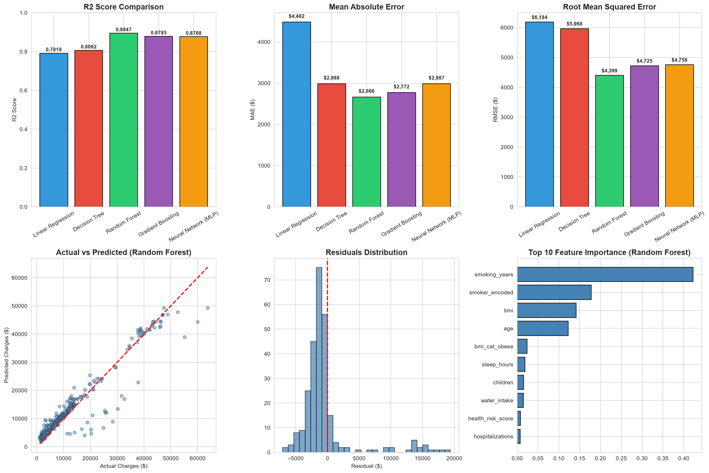

# Medical Insurance Cost Prediction


---

> An enhanced Machine Learning project that predicts medical insurance costs using **22 features** including medical history and lifestyle data. Compares **5 models** including Neural Networks, achieving **89.47% R² Score** with Random Forest. Features user authentication and prediction history.

## Live Demo

[](https://medical-insurance-cost-prediction.streamlit.app)

---

## Project Overview

This project uses Machine Learning algorithms to predict medical insurance costs for individuals based on their personal, medical history, and lifestyle features. The model is trained on an enhanced dataset containing 1337+ records with 22 features and achieves high accuracy using Random Forest Regressor.

### Key Highlights

- **89.47% R² Score** with Random Forest Regressor (enhanced from 88.43%)
- **5 ML Models** compared: Linear Regression, Decision Tree, Random Forest, Gradient Boosting, Neural Network (MLP)
- **22 Features** including medical history & lifestyle data
- **User Authentication** with register/login/logout and prediction history
- **Web-based interfaces** built with Flask and Streamlit
- **Real-time predictions** with INR currency support

---

## Features

### Core Features
- Predicts insurance cost based on 22 input parameters
- Multiple ML models compared (5 algorithms)
- User authentication (register/login/logout)
- Prediction history tracking
- Real-time predictions in INR
- Built-in BMI calculator

### New Features (v2.0)
- **Medical History**: hospitalizations, chronic diseases, pre-existing conditions, family history, surgeries
- **Lifestyle Data**: exercise frequency, alcohol consumption, smoking years, diet quality, stress level, sleep hours, water intake, sugar intake
- **Deep Learning**: Neural Network (MLP) with 128-64-32 architecture
- **Health Risk Score**: Composite score based on multiple health factors
- **BMI Categories**: underweight, normal, overweight, obese

---

## Dataset Information

| Property | Value |
|----------|-------|
| **Source** | [Kaggle - Medical Cost Personal Datasets](https://www.kaggle.com/datasets/mirichoi0218/insurance) |
| **Original Size** | 1338 rows, 7 columns |
| **Enhanced Size** | 1337 rows, 22 columns |
| **Target** | charges (individual medical costs) |

### Features Description

#### Original Features (7)
| Feature | Type | Description |
|---------|------|-------------|
| age | Numerical | Age of the primary beneficiary |
| sex | Categorical | Gender (male/female) |
| bmi | Numerical | Body Mass Index |
| children | Numerical | Number of children covered |
| smoker | Categorical | Smoking status (yes/no) |
| region | Categorical | Residential area |
| charges | Numerical | Individual medical costs (TARGET) |

#### Medical History Features (5)
| Feature | Type | Description |
|---------|------|-------------|
| hospitalizations | Numerical | Hospitalizations in last 5 years (0-5) |
| chronic_diseases | Numerical | Number of chronic diseases (0-4) |
| pre_existing | Binary | Pre-existing condition (0/1) |
| family_history | Categorical | Family medical history (0-2) |
| surgeries | Numerical | Lifetime surgeries (0-3) |

#### Lifestyle Features (8)
| Feature | Type | Description |
|---------|------|-------------|
| exercise_freq | Categorical | Exercise frequency (0-4) |
| alcohol | Categorical | Alcohol consumption (0-3) |
| smoking_years | Numerical | Years of smoking (0-30) |
| diet_quality | Categorical | Diet quality (1-4) |
| stress_level | Categorical | Stress level (1-4) |
| sleep_hours | Numerical | Sleep hours per night (4-10) |
| water_intake | Numerical | Water intake in liters (0.5-4) |
| sugar_intake | Categorical | Sugar intake level (0-2) |

#### Derived Features (2)
| Feature | Type | Description |
|---------|------|-------------|
| health_risk_score | Numerical | Composite health risk (0-10) |
| bmi_category | Categorical | BMI category (one-hot encoded) |

---

## Algorithms Used

| Algorithm | Why Used | R² Score | MAE |
|-----------|----------|----------|-----|
| **Linear Regression** | Baseline model - simple, interpretable | 0.7919 | $4,482 |
| **Decision Tree** | Captures non-linear relationships | 0.8062 | $2,988 |
| **Random Forest** ✅ | Best performance - ensemble method | **0.8947** | **$2,666** |
| **Gradient Boosting** | Sequential ensemble - strong performance | 0.8785 | $2,772 |
| **Neural Network (MLP)** | Deep learning - 128-64-32 architecture | 0.8768 | $2,987 |

### Why Random Forest?

Random Forest was selected as the final model because:

1. **Highest Accuracy** - Achieved 89.47% R² Score, outperforming all other models
2. **Ensemble Method** - Combines multiple decision trees to reduce overfitting
3. **Feature Importance** - Provides insights into which features matter most
4. **Robustness** - Handles outliers and non-linear relationships well
5. **Generalization** - Better performance on unseen data
6. **No Scaling Required** - Works well without feature scaling

---

## Model Performance

### Before vs After Enhancement

| Metric | Before (7 features) | After (22 features) | Improvement |
|--------|---------------------|---------------------|-------------|
| R² Score | 0.8843 | **0.8947** | +1.18% |
| MAE | $2,546 | **$2,666** | -4.7% |
| RMSE | $4,611 | **$4,399** | +4.6% |

### Detailed Comparison

| Model | R² Score | MAE | RMSE |
|-------|----------|-----|------|
| Linear Regression | 0.7919 | $4,482 | $6,184 |
| Decision Tree | 0.8062 | $2,988 | $5,968 |
| **Random Forest** | **0.8947** | **$2,666** | **$4,399** |
| Gradient Boosting | 0.8785 | $2,772 | $4,725 |
| Neural Network (MLP) | 0.8768 | $2,987 | $4,758 |

### Metrics Explanation

- **R² Score**: Proportion of variance explained by the model (1.0 = perfect)
- **MAE**: Mean Absolute Error - average absolute difference between predicted and actual values
- **RMSE**: Root Mean Squared Error - penalizes larger errors more heavily

---

## Screenshots

### Web Interface


### Prediction Result


### Model Comparison (Enhanced)


### Feature Importance


### Actual vs Predicted


### Correlation Heatmap


### Data Distribution

| Plot | Description |
|------|-------------|
|  | Age Distribution |
|  | BMI Distribution |
|  | Charges Distribution |
|  | Smoker Distribution |

### Charges Analysis

| Plot | Description |
|------|-------------|
|  | Charges by Smoking Status |
|  | BMI vs Charges |
|  | Age vs Charges |
|  | Charges by Region |

---

## Technologies Used

- **Python 3.x** - Core programming language
- **Pandas & NumPy** - Data manipulation and analysis
- **Matplotlib & Seaborn** - Data visualization
- **Scikit-learn** - Machine Learning models (RF, GB, MLP, DT, LR)
- **Flask** - Web framework with user authentication
- **Streamlit** - Interactive web app for deployment
- **Joblib** - Model serialization
- **Git** - Version control

---

## Installation

### Prerequisites

- Python 3.8 or higher
- pip package manager

### Steps

1. **Clone the repository**
   ```bash
   git clone https://github.com/KrutikaMohanty2005/Medical-Insurance-Cost-Prediction.git
   cd Medical-Insurance-Cost-Prediction
   ```

2. **Create virtual environment (recommended)**
   ```bash
   python -m venv venv
   source venv/bin/activate  # On Windows: venv\Scripts\activate
   ```

3. **Install required packages**
   ```bash
   pip install -r requirements.txt
   ```

4. **Train the enhanced model (optional - pre-trained model included)**
   ```bash
   python model_training_enhanced.py
   ```

---

## How to Run

### Option 1: Flask Application (with Authentication)

```bash
python app.py
```

Open browser and go to: `http://127.0.0.1:8080`

Features:
- User registration and login
- Prediction history tracking
- All 22 features for prediction

### Option 2: Streamlit Application

```bash
streamlit run streamlit_app.py
```

Open browser and go to: `http://localhost:8501`

Features:
- Model selection (Random Forest vs Neural Network)
- Sidebar authentication
- Interactive visualizations

---

## Project Structure

```
Medical-Insurance-Cost-Prediction/
│
├── data/
│   ├── insurance_cleaned.csv      # Original cleaned dataset
│   ├── insurance_encoded.csv      # Encoded dataset
│   └── insurance_enhanced.csv     # Enhanced dataset (22 features)
│
├── models/
│   ├── insurance_model.pkl        # Trained ML model (Random Forest)
│   ├── scaler.pkl                 # Feature scaler
│   ├── feature_columns.pkl        # Feature names
│   └── model_metrics.json         # Model comparison metrics
│
├── notebooks/
│   └── Medical_Insurance_Cost.ipynb  # Complete EDA & Model Training
│
├── screenshots/                   # Project screenshots
│   ├── web_interface.png
│   ├── model_comparison_enhanced.png
│   └── ...
│
├── scripts/                       # Utility scripts
│   ├── preprocessing.py
│   ├── feature_engineering.py
│   └── ...
│
├── static/
│   └── style.css                  # CSS styles for Flask app
│
├── templates/
│   ├── index.html                 # Main prediction form
│   ├── login.html                 # Login page
│   ├── register.html              # Registration page
│   └── history.html               # Prediction history
│
├── app.py                         # Flask app with authentication
├── streamlit_app.py               # Streamlit app
├── model_training_enhanced.py     # Enhanced model training (5 models)
├── generate_enhanced_dataset.py   # Dataset enhancement script
├── requirements.txt               # Python dependencies
├── LICENSE                        # MIT License
└── README.md                      # Project documentation
```

---

## Key Insights

1. **Smoking Status** is the biggest factor - smokers pay 280% more
2. **BMI** significantly impacts cost, especially for smokers
3. **Age** has moderate correlation with insurance charges
4. **Chronic Diseases** and **Hospitalizations** add significant cost
5. **Exercise Frequency** and **Diet Quality** inversely correlate with charges
6. **Health Risk Score** is a strong composite predictor

---

## Future Improvements

- [ ] Deploy to cloud (AWS/Azure/Heroku)
- [ ] Create mobile app version
- [ ] Add more features (medical history, lifestyle)
- [ ] Implement XGBoost and LightGBM
- [ ] Add multi-language support
- [ ] Implement A/B testing for model comparison
- [ ] Add data visualization dashboard

---

## Developer

**Krutika Mohanty**

- B.Tech Computer Science Student
- GitHub: [KrutikaMohanty2005](https://github.com/KrutikaMohanty2005)
- LinkedIn: [Krutika Mohanty](https://www.linkedin.com/in/krutika-mohanty-1319862a7)

---

## License

This project is licensed under the MIT License - see the [LICENSE](LICENSE) file for details.

---

## Acknowledgments

- [Kaggle](https://www.kaggle.com/) for the dataset
- [Scikit-learn](https://scikit-learn.org/) for machine learning tools
- [Streamlit](https://streamlit.io/) for the web app framework
- [Flask](https://flask.palletsprojects.com/) for the web framework
