# Medical Insurance Cost Prediction

A Machine Learning project that predicts medical insurance costs based on personal attributes like age, BMI, smoking status, and more.

## Project Overview

This project uses Machine Learning algorithms to predict the medical insurance cost for individuals based on their personal and health-related features. The model is trained on a real-world dataset containing 1337+ records and achieves high accuracy using Random Forest Regressor.

## Features

- Predicts insurance cost based on 6 input parameters
- Web-based interface built with Flask
- Multiple ML models compared (Linear Regression, Decision Tree, Random Forest)
- Interactive and responsive UI
- Real-time predictions

## Technologies Used

- **Python 3.x** - Core programming language
- **Pandas & NumPy** - Data manipulation and analysis
- **Matplotlib & Seaborn** - Data visualization
- **Scikit-learn** - Machine Learning models
- **Flask** - Web framework
- **Joblib** - Model serialization
- **Git** - Version control

## Dataset

- **Source:** [Kaggle - Medical Cost Personal Datasets](https://www.kaggle.com/datasets/mirichoi0218/insurance)
- **Size:** 1338 rows, 7 columns
- **Features:** age, sex, bmi, children, smoker, region, charges

## Installation Steps

1. **Clone the repository:**
```bash
git clone https://github.com/KrutikaMohanty2005/Medical-Insurance-Cost-Prediction.git
cd Medical-Insurance-Cost-Prediction
```

2. **Install required packages:**
```bash
pip install -r requirements.txt
```

3. **Train the model (optional):**
```bash
python model_training.py
```

4. **Run the Flask application:**
```bash
python app.py
```

5. **Open browser and go to:**
```
http://127.0.0.1:5000
```

## Project Structure

```
Medical-Insurance-Cost-Prediction/
│
├── data/
│   ├── insurance.csv              # Original dataset
│   ├── insurance_cleaned.csv      # Cleaned dataset
│   └── insurance_encoded.csv      # Encoded dataset
│
├── models/
│   ├── insurance_model.pkl        # Trained ML model
│   ├── scaler.pkl                 # Feature scaler
│   └── feature_columns.pkl        # Feature names
│
├── static/
│   ├── style.css                  # CSS styles
│   └── *.png                      # Generated charts
│
├── templates/
│   └── index.html                 # Web interface
│
├── app.py                         # Flask application
├── model_training.py              # ML model training
├── preprocessing.py               # Data cleaning
├── feature_engineering.py         # Feature encoding
├── eda.py                         # Exploratory Data Analysis
└── requirements.txt               # Python dependencies
```

## Screenshots

### Web Interface
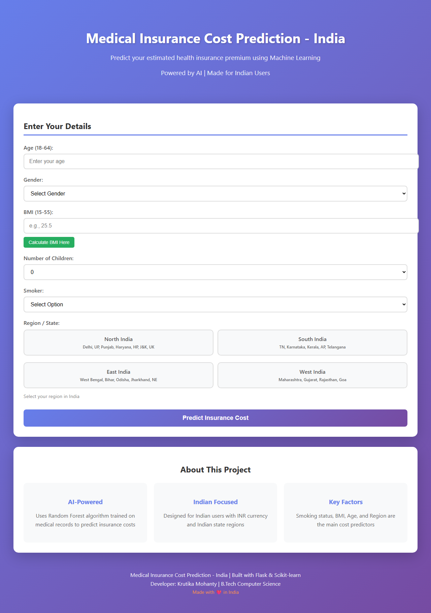

### Prediction Result
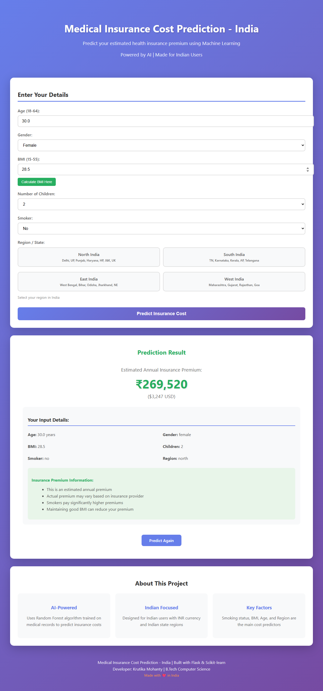

### Model Comparison


### Feature Importance
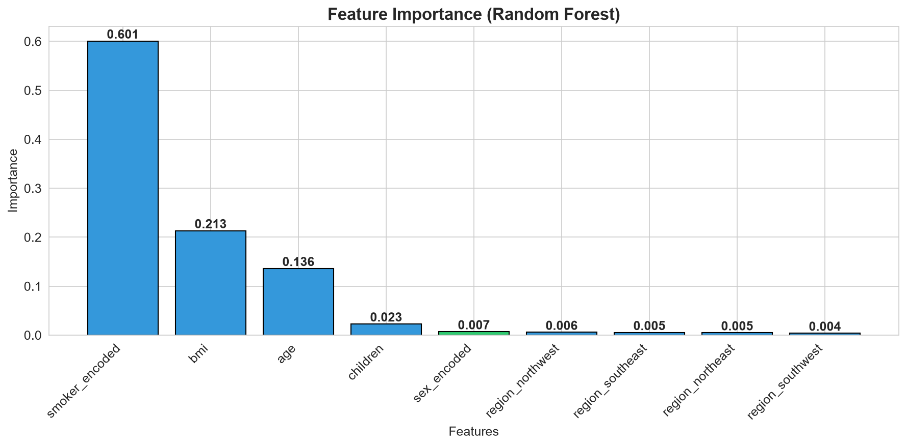

### Actual vs Predicted


### BMI vs Charges by Smoker
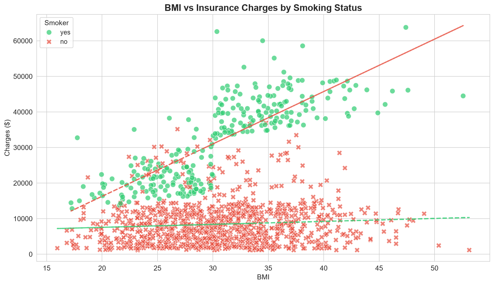

### Age and Charges by Smoking Status
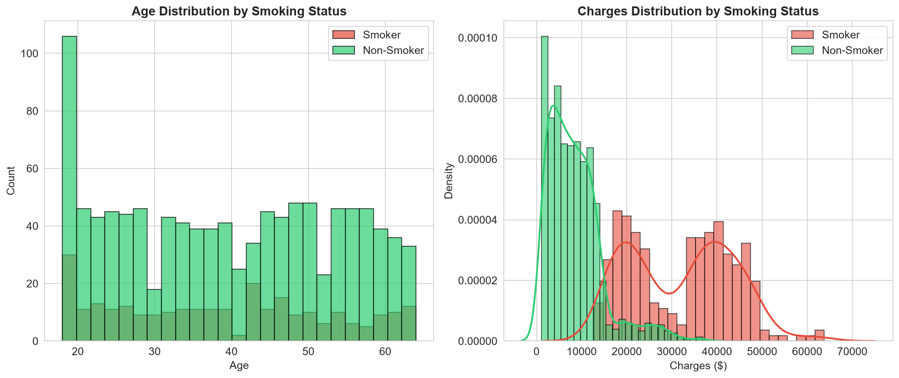

### Residuals Analysis
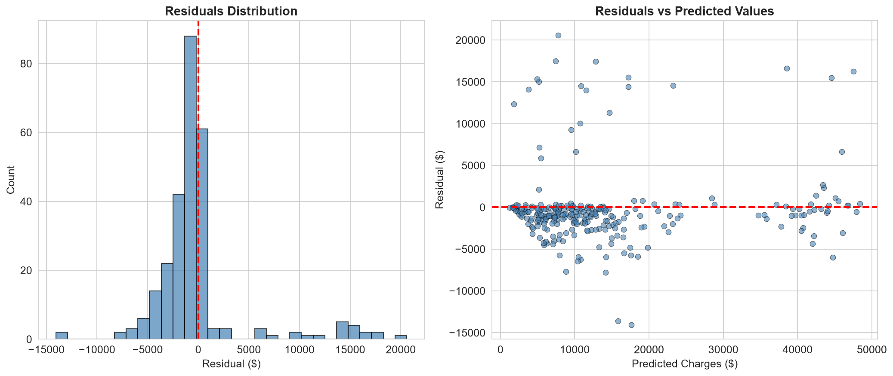

### Charges by Region and Smoker
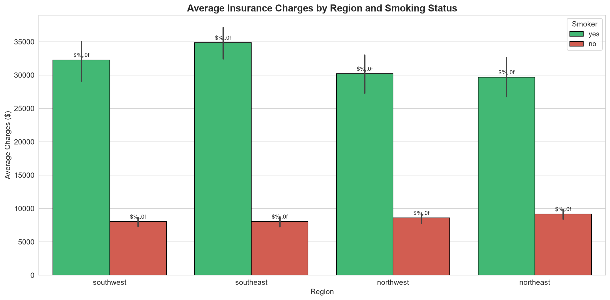

### Charges by Number of Children
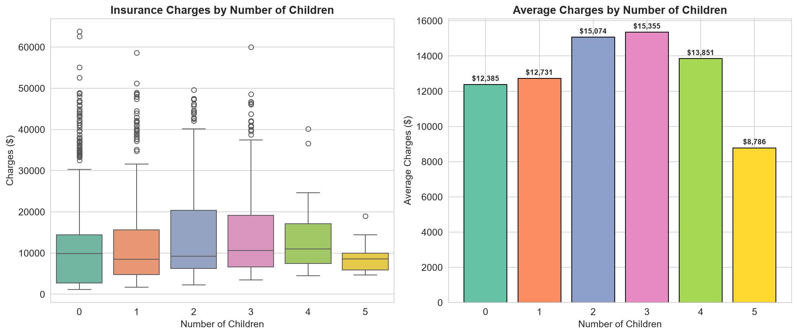

### Correlation Heatmap


### Data Distribution

| Plot | Description |
|------|-------------|
|  | Age Distribution |
| 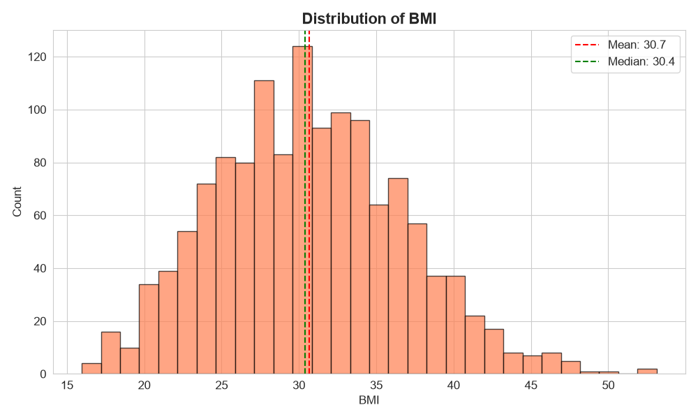 | BMI Distribution |
|  | Charges Distribution |
| 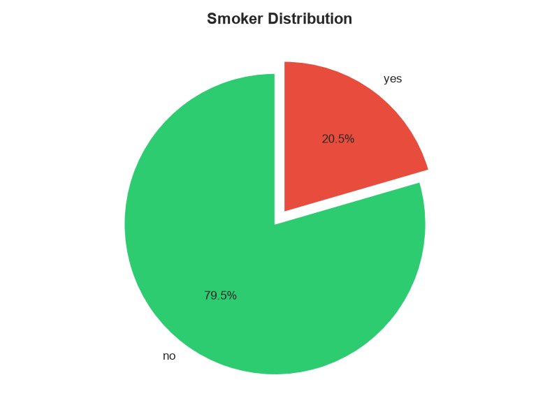 | Smoker Distribution |
| 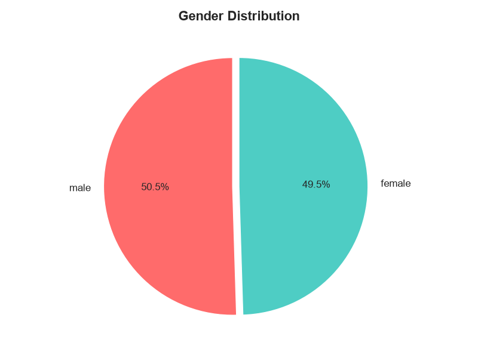 | Gender Distribution |
| 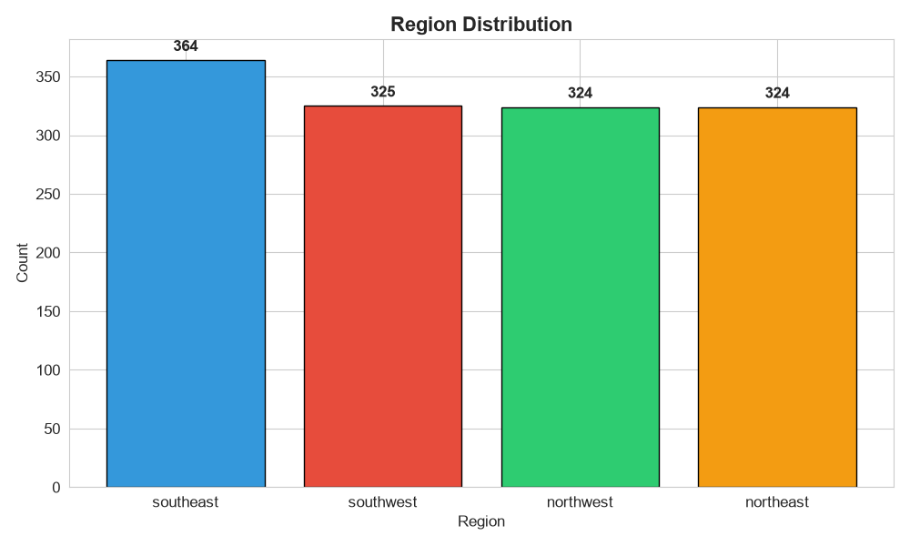 | Region Distribution |

### Charges Analysis

| Plot | Description |
|------|-------------|
|  | Charges by Smoking Status |
| 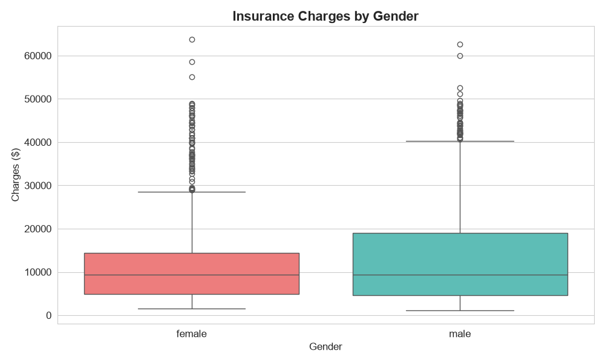 | Charges by Gender |
|  | Charges by Region |
| 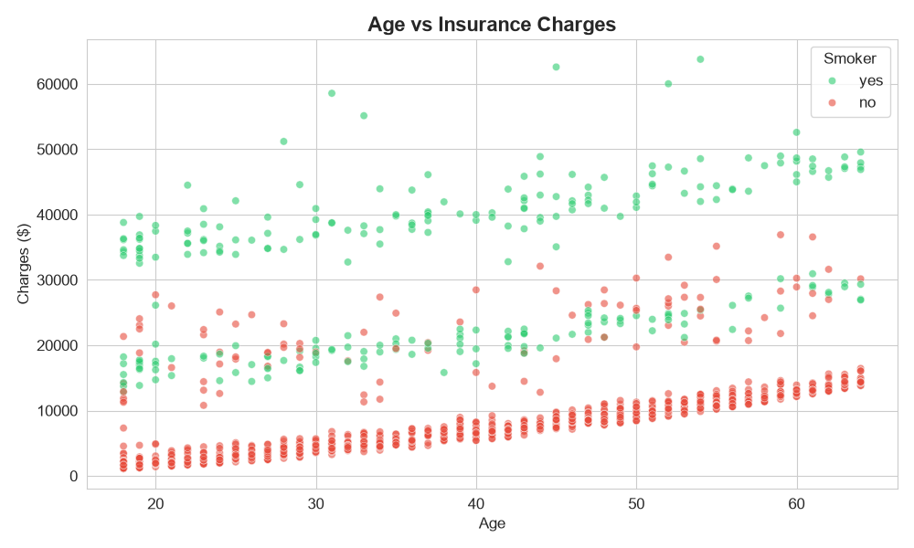 | Age vs Charges |
| 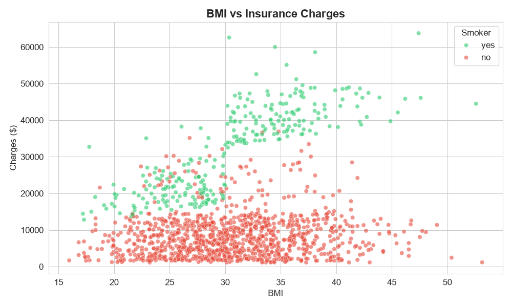 | BMI vs Charges |

## Model Performance

| Model | MAE | RMSE | R2 Score |
|-------|-----|------|----------|
| Linear Regression | ~$4,200 | ~$6,000 | ~0.75 |
| Decision Tree | ~$3,000 | ~$6,500 | ~0.72 |
| Random Forest | ~$2,500 | ~$4,800 | ~0.85 |

**Best Model:** Random Forest with ~85% R2 Score

## Key Insights

1. **Smoking Status** is the biggest factor - smokers pay 280% more
2. **BMI** significantly impacts cost, especially for smokers
3. **Age** has moderate correlation with insurance charges
4. **Region** has minimal impact on costs

## Future Improvements

- [ ] Add more features (medical history, lifestyle)
- [ ] Implement deep learning models
- [ ] Add user authentication
- [ ] Deploy to cloud (Heroku/AWS)
- [ ] Create mobile app version

## Developer

**Krutika Mohanty**
- B.Tech Computer Science Student
- GitHub: [KrutikaMohanty2005](https://github.com/KrutikaMohanty2005)
- LinkedIn: [Krutika Mohanty](https://www.linkedin.com/in/krutika-mohanty-1319862a7)

## License

This project is open source and available for educational purposes.
