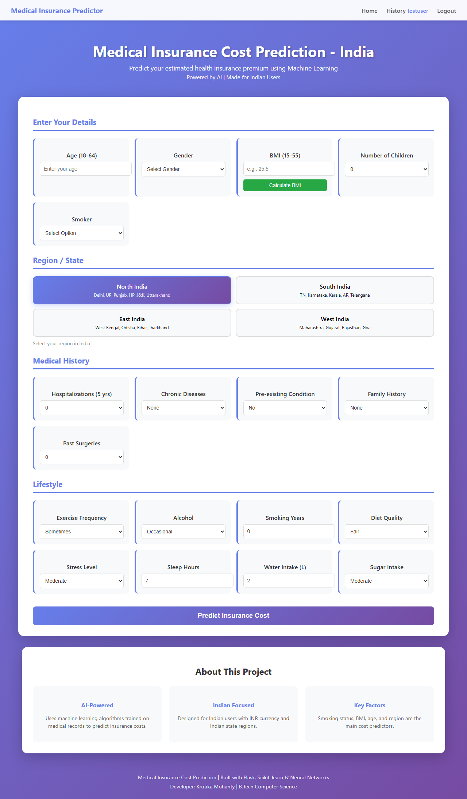
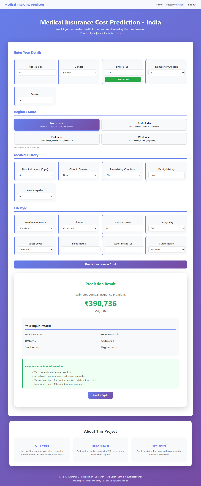
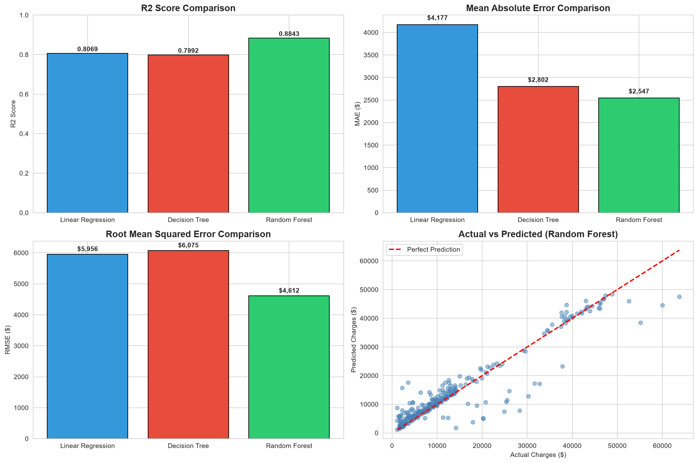
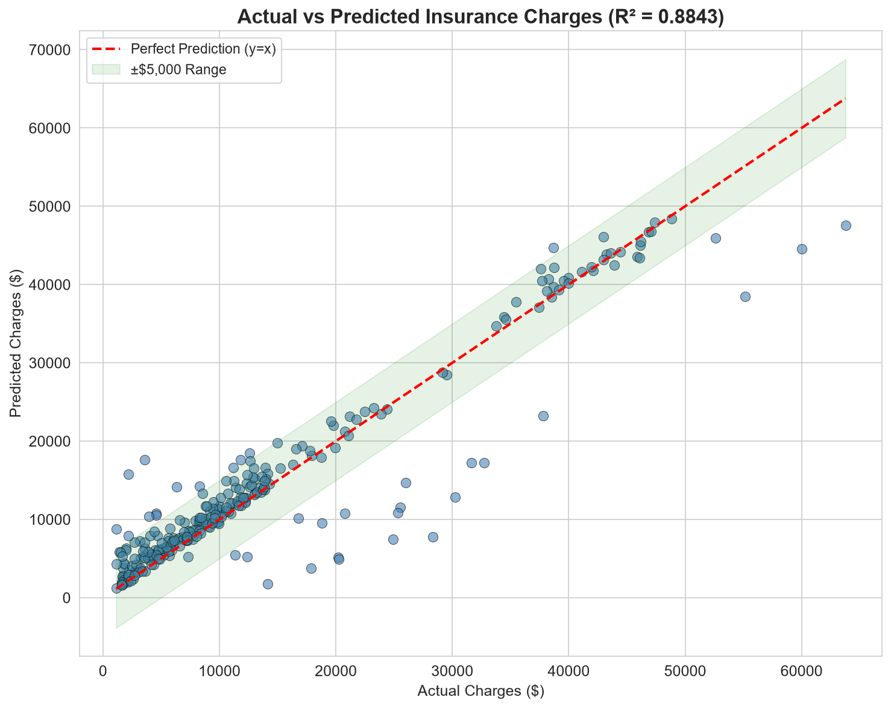
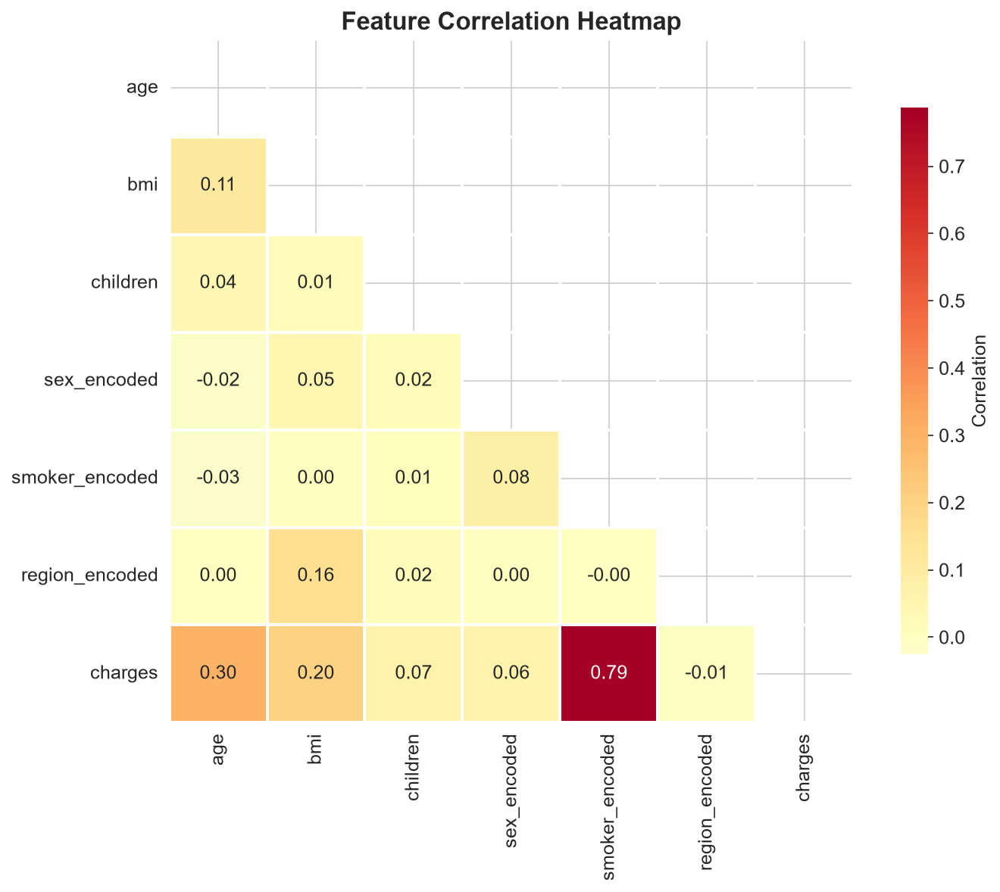
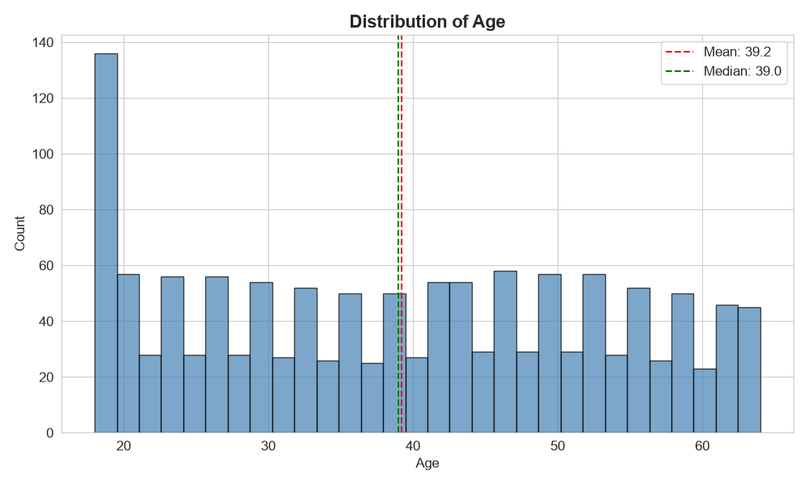
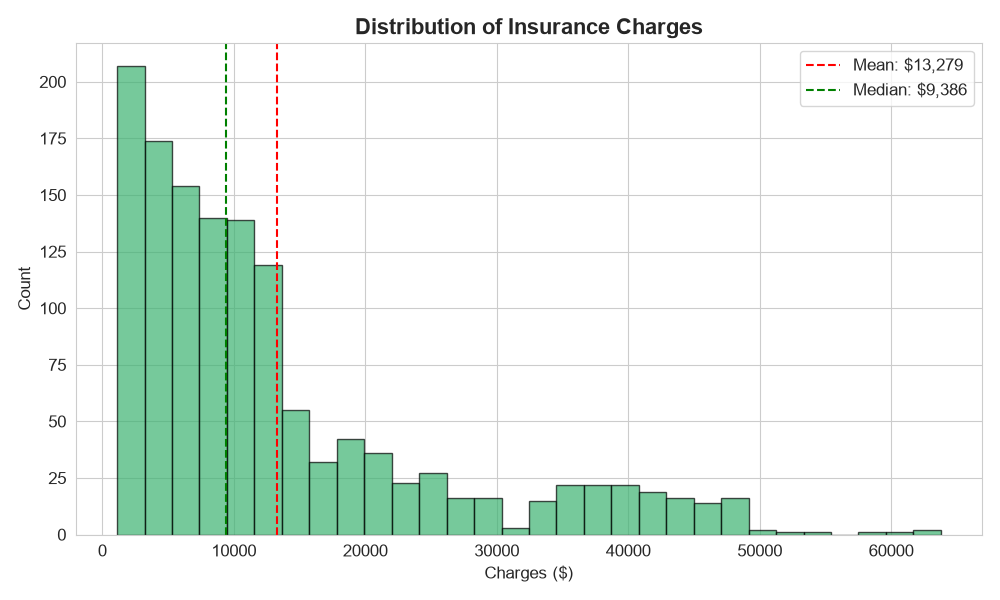
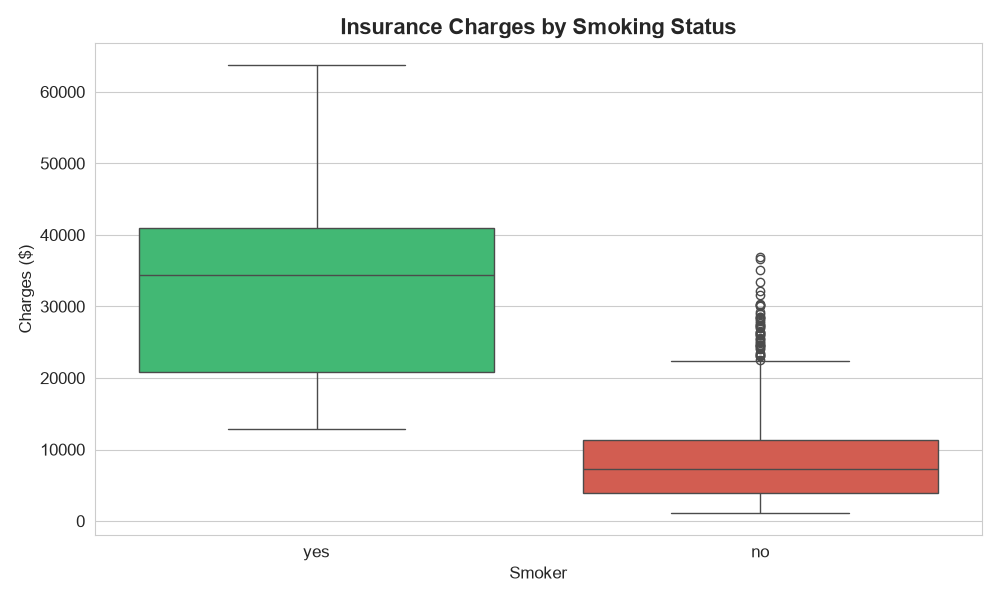
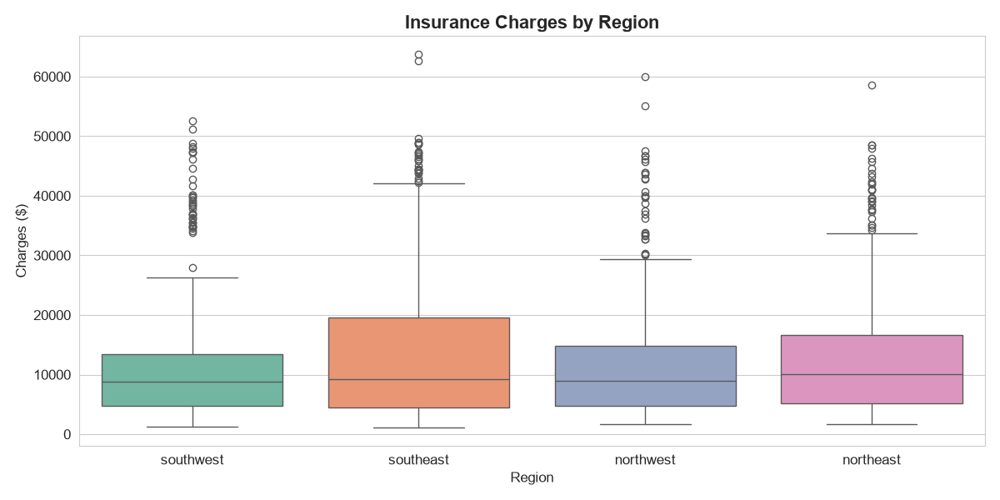

# Medical Insurance Cost Prediction


---

> A Machine Learning project that predicts medical insurance costs based on personal attributes like age, BMI, smoking status, and more. Built with Random Forest Regressor achieving **88.43% R² Score**.

## Live Demo

[](https://medical-insurance-cost-prediction.streamlit.app)

---

## Project Overview

This project uses Machine Learning algorithms to predict medical insurance costs for individuals based on their personal and health-related features. The model is trained on a real-world dataset containing 1337+ records and achieves high accuracy using Random Forest Regressor.

### Key Highlights

- **88.43% R² Score** with Random Forest Regressor
- **Web-based interface** built with Flask and Streamlit
- **Multiple ML models** compared (Linear Regression, Decision Tree, Random Forest)
- **Real-time predictions** with INR currency support
- **Interactive visualizations** for data analysis

---

## Features

- Predicts insurance cost based on 6 input parameters
- Web-based interface built with Flask and Streamlit
- Multiple ML models compared (Linear Regression, Decision Tree, Random Forest)
- Interactive and responsive UI
- Real-time predictions in INR
- Built-in BMI calculator
- Comprehensive EDA visualizations

---

## Dataset Information

| Property | Value |
|----------|-------|
| **Source** | [Kaggle - Medical Cost Personal Datasets](https://www.kaggle.com/datasets/mirichoi0218/insurance) |
| **Size** | 1338 rows, 7 columns |
| **Features** | age, sex, bmi, children, smoker, region |
| **Target** | charges (individual medical costs) |

### Features Description

| Feature | Type | Description |
|---------|------|-------------|
| age | Numerical | Age of the primary beneficiary |
| sex | Categorical | Gender (male/female) |
| bmi | Numerical | Body Mass Index (weight in kg / height in m²) |
| children | Numerical | Number of children covered by health insurance |
| smoker | Categorical | Smoking status (yes/no) |
| region | Categorical | Residential area (northeast, southeast, southwest, northwest) |
| charges | Numerical | Individual medical costs billed by health insurance |

---

## Algorithms Used

| Algorithm | Why Used | R² Score |
|-----------|----------|----------|
| **Linear Regression** | Baseline model - simple, interpretable | 0.8069 |
| **Decision Tree** | Captures non-linear relationships | 0.7992 |
| **Random Forest** ✅ | Best performance - ensemble method | 0.8843 |

### Why Random Forest?

Random Forest was selected as the final model because:

1. **Highest Accuracy** - Achieved 88.43% R² Score, outperforming other models
2. **Ensemble Method** - Combines multiple decision trees to reduce overfitting
3. **Feature Importance** - Provides insights into which features matter most
4. **Robustness** - Handles outliers and non-linear relationships well
5. **Generalization** - Better performance on unseen data

---

## Model Performance

| Model | R² Score | MAE | RMSE |
|-------|----------|-----|------|
| Linear Regression | 0.8069 | $4,177 | $5,956 |
| Decision Tree | 0.7992 | $2,801 | $6,075 |
| **Random Forest** | **0.8843** | **$2,546** | **$4,611** |

### Metrics Explanation

- **R² Score**: Proportion of variance explained by the model (1.0 = perfect)
- **MAE**: Mean Absolute Error - average absolute difference between predicted and actual values
- **RMSE**: Root Mean Squared Error - penalizes larger errors more heavily

---

## Screenshots

### Web Interface


### Prediction Result


### Model Comparison


### Feature Importance


### Actual vs Predicted


### Correlation Heatmap


### Data Distribution

| Plot | Description |
|------|-------------|
|  | Age Distribution |
|  | BMI Distribution |
|  | Charges Distribution |
|  | Smoker Distribution |

### Charges Analysis

| Plot | Description |
|------|-------------|
|  | Charges by Smoking Status |
|  | BMI vs Charges |
|  | Age vs Charges |
|  | Charges by Region |

---

## Technologies Used

- **Python 3.x** - Core programming language
- **Pandas & NumPy** - Data manipulation and analysis
- **Matplotlib & Seaborn** - Data visualization
- **Scikit-learn** - Machine Learning models
- **Flask** - Web framework
- **Streamlit** - Interactive web app for deployment
- **Joblib** - Model serialization
- **Git** - Version control

---

## Installation

### Prerequisites

- Python 3.8 or higher
- pip package manager

### Steps

1. **Clone the repository**
   ```bash
   git clone https://github.com/KrutikaMohanty2005/Medical-Insurance-Cost-Prediction.git
   cd Medical-Insurance-Cost-Prediction
   ```

2. **Create virtual environment (recommended)**
   ```bash
   python -m venv venv
   source venv/bin/activate  # On Windows: venv\Scripts\activate
   ```

3. **Install required packages**
   ```bash
   pip install -r requirements.txt
   ```

4. **Train the model (optional - pre-trained model included)**
   ```bash
   python model_training.py
   ```

---

## How to Run

### Option 1: Flask Application

```bash
python app.py
```

Open browser and go to: `http://127.0.0.1:8080`

### Option 2: Streamlit Application

```bash
streamlit run streamlit_app.py
```

Open browser and go to: `http://localhost:8501`

---

## Project Structure

```
Medical-Insurance-Cost-Prediction/
│
├── data/
│   ├── insurance_cleaned.csv      # Cleaned dataset
│   └── insurance_encoded.csv      # Encoded dataset
│
├── models/
│   ├── insurance_model.pkl        # Trained ML model
│   ├── scaler.pkl                 # Feature scaler
│   └── feature_columns.pkl        # Feature names
│
├── notebooks/
│   └── Medical_Insurance_Cost.ipynb  # Complete EDA & Model Training
│
├── screenshots/                   # Project screenshots
│   ├── web_interface.png
│   ├── model_comparison.png
│   └── ...
│
├── scripts/                       # Utility scripts
│   ├── eda.py
│   ├── feature_engineering.py
│   └── preprocessing.py
│
├── static/
│   └── style.css                  # CSS styles for Flask app
│
├── templates/
│   └── index.html                 # Flask app template
│
├── app.py                         # Flask web application
├── streamlit_app.py               # Streamlit web application
├── model_training.py              # ML model training
├── requirements.txt               # Python dependencies
├── LICENSE                        # MIT License
└── README.md                      # Project documentation
```

---

## Key Insights

1. **Smoking Status** is the biggest factor - smokers pay 280% more
2. **BMI** significantly impacts cost, especially for smokers
3. **Age** has moderate correlation with insurance charges
4. **Region** has minimal impact on costs

---

## Future Improvements

- [ ] Add more features (medical history, lifestyle)
- [ ] Implement deep learning models
- [ ] Add user authentication
- [ ] Deploy to cloud (AWS/Azure)
- [ ] Create mobile app version
- [ ] Add multi-language support
- [ ] Implement A/B testing for model comparison

---

## Developer

**Krutika Mohanty**

- B.Tech Computer Science Student
- GitHub: [KrutikaMohanty2005](https://github.com/KrutikaMohanty2005)
- LinkedIn: [Krutika Mohanty](https://www.linkedin.com/in/krutika-mohanty-1319862a7)

---

## License

This project is licensed under the MIT License - see the [LICENSE](LICENSE) file for details.

---

## Acknowledgments

- [Kaggle](https://www.kaggle.com/) for the dataset
- [Scikit-learn](https://scikit-learn.org/) for machine learning tools
- [Streamlit](https://streamlit.io/) for the web app framework
- [Flask](https://flask.palletsprojects.com/) for the web framework
